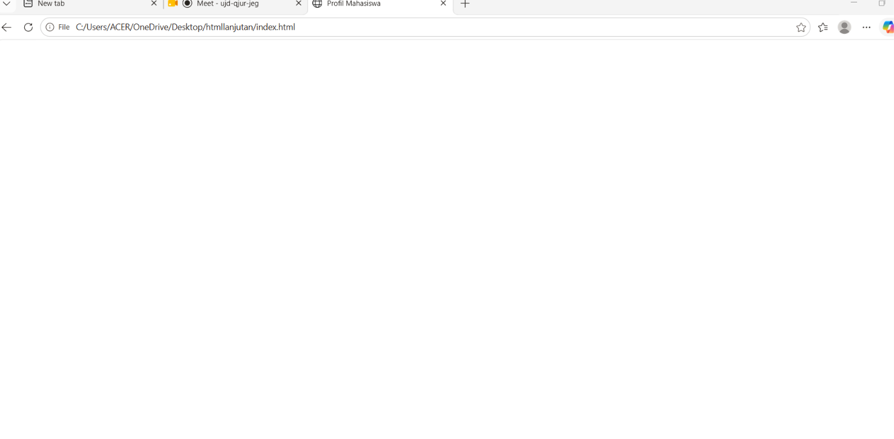
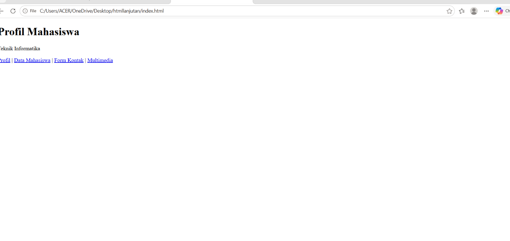
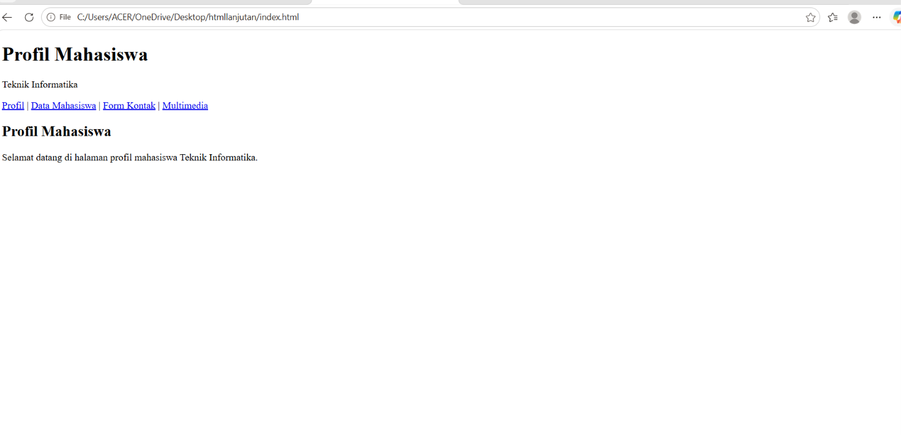
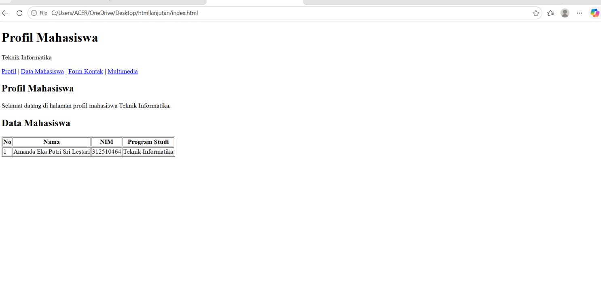
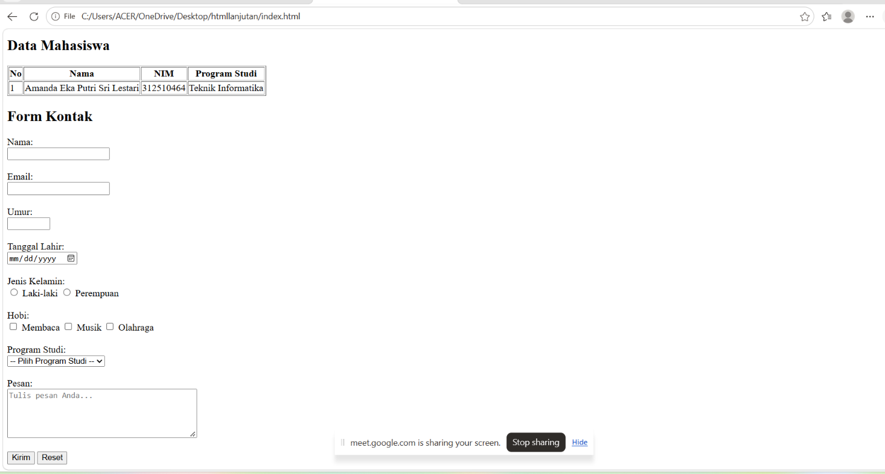
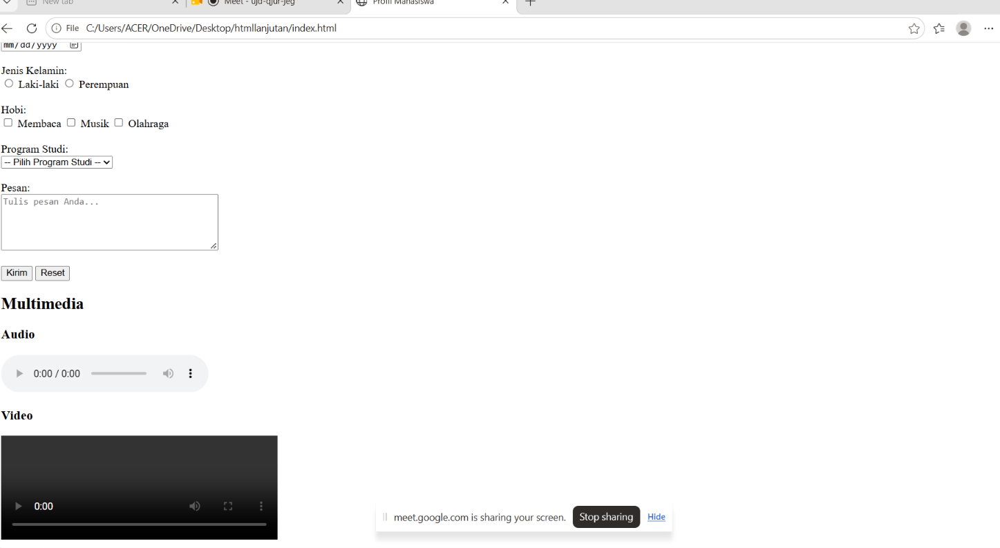
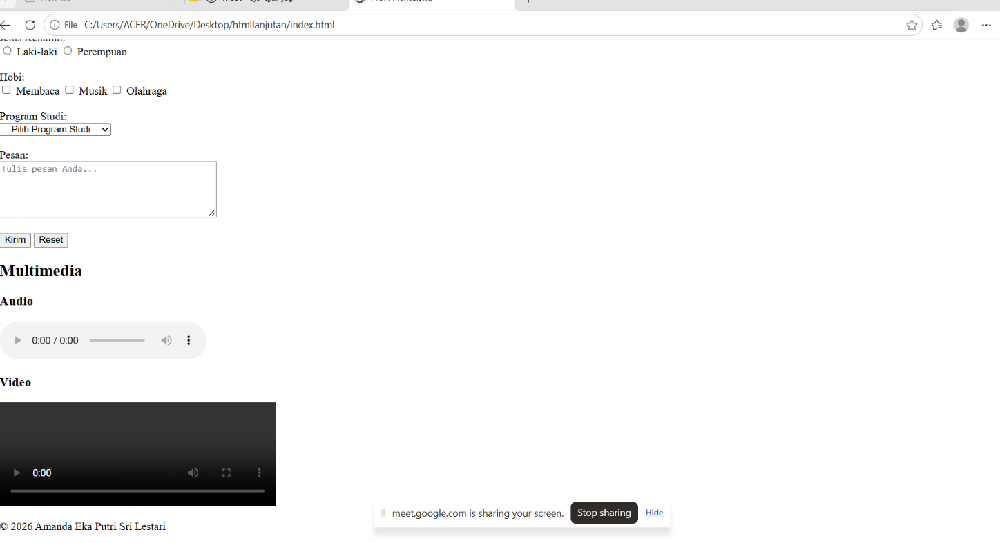
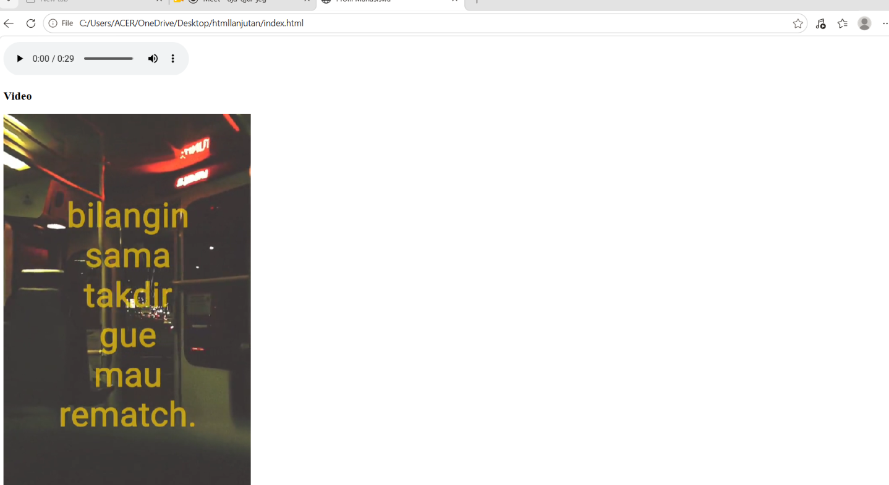
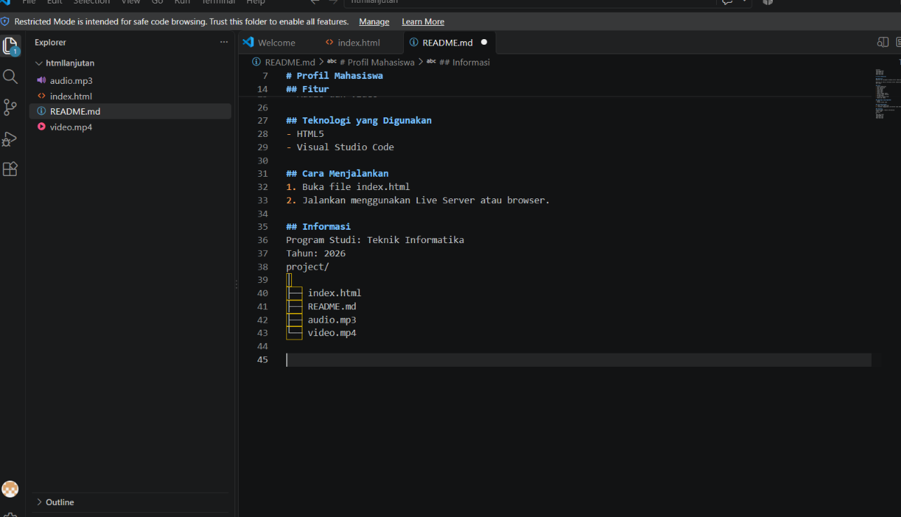

project/
├── index.html
├── README.md
├── screenshot.png
├── audio.mp3
└── video.mp4

# Profil Mahasiswa

## Deskripsi
Website ini merupakan halaman profil mahasiswa Teknik Informatika yang dibuat menggunakan HTML.

Website ini berisi informasi profil mahasiswa, data mahasiswa, form kontak, serta multimedia berupa audio dan video.

## Fitur
- Profil Mahasiswa
- Data Mahasiswa
- Form Kontak
- Input Nama
- Input Email
- Input Umur
- Input Tanggal Lahir
- Pilihan Jenis Kelamin
- Pilihan Hobi
- Pilihan Program Studi
- Audio dan Video

## Teknologi yang Digunakan
- HTML5
- Visual Studio Code

## Cara Menjalankan
1. Buka file index.html
2. Jalankan menggunakan Live Server atau browser.

## Informasi
Program Studi: Teknik Informatika
Tahun: 2026

## Screenshot

### Tampilan Website

## Dokumentasi

### 1. Tampilan README

### 2. Tampilan Website

### 3. Tampilan Form

## Dokumentasi

### 1. Tampilan README

### 2. Tampilan Website

### 3. Tampilan Form

## Dokumentasi

### 1. Tampilan README

### 2. Tampilan Website

### 3. Tampilan Form

project/
├── index.html
├── README.md
├── screenshot.png
├── audio.mp3
└── video.mp4

